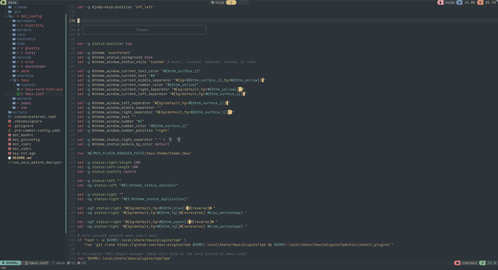

# Getting Started

## 1. Clone the plugin

```bash
mkdir -p ~/.config/tmux/plugins/tmux-theme
git clone <repo-url> ~/.config/tmux/plugins/tmux-theme
```

## 2. Load it from `~/.tmux.conf`

```bash
set -g @theme "everforest"

run ~/.config/tmux/plugins/tmux-theme/theme.tmux
```

Restart tmux or run `tmux source ~/.tmux.conf`.

## 3. Pick a different built-in theme

```bash
set -g @theme "rosepine"

run ~/.config/tmux/plugins/tmux-theme/theme.tmux
```

Built-ins include the four `catppuccin-*` themes plus `bearded-arc`, `everforest`, `everforest_light`, `gruvchad`, `one_light`, `rosepine`, and `tundra`.

## 4. Customize the status line

```bash
set -g status-left ""
set -g status-right '#[fg=#{@thm_crust},bg=#{@thm_teal}] session: #S '
set -g status-right-length 100
```

`@thm_*` values are available after `run ~/.config/tmux/plugins/tmux-theme/theme.tmux`.

## 5. Use an external theme

Create `~/.config/tmux/theme/my-theme.conf` and define the `@thm_*` values there:

```bash
set -g @theme "my-theme"

run ~/.config/tmux/plugins/tmux-theme/theme.tmux
```

If `my-theme.conf` is missing, the plugin falls back to a built-in theme with the same name and then to `everforest`.



Demo configuration reference: [smoosex/dotfiles](https://github.com/smoosex/dotfiles)
